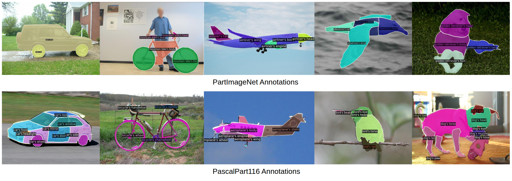
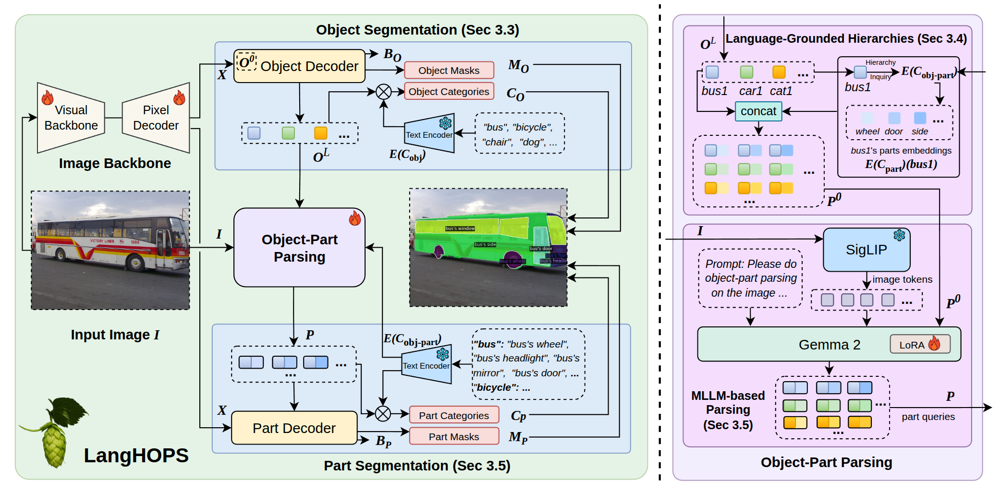
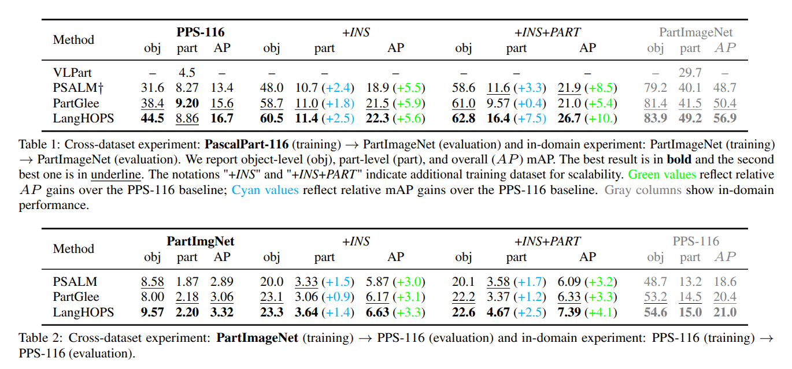
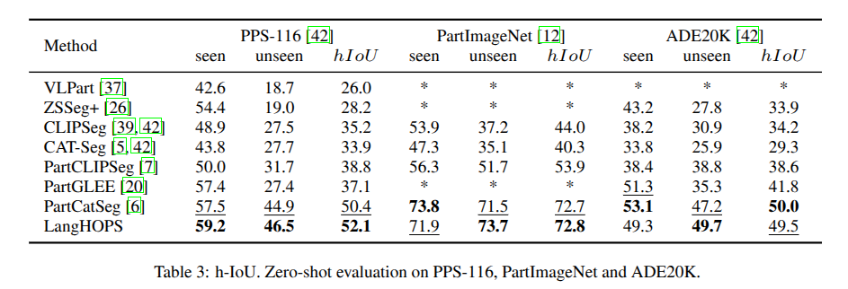

<div align="center">
<h2>LangHOPS: Language Grounded Hierarchical Open-Vocabulary Part Segmentation</h2>

[**Yang Miao**](https://y9miao.github.io/)<sup>1</sup> · [**Jan-Nico Zaech**](https://insait.ai/nico-zaech)<sup>1</sup> · [**Xi Wang**](https://xiwang1212.github.io/homepage/)<sup>1, 2, 3</sup> · [**Fabien Despinoy**](https://www.linkedin.com/in/fabiendespinoy/)<sup>4</sup> · [**Danda Pani Paudel**](https://insait.ai/dr-danda-paudel/)<sup>1</sup>· [**Luc Van Gool**](https://insait.ai/prof-luc-van-gool/)<sup>1</sup>

<sup>1</sup>INSAIT, Sofia University&emsp;&emsp;&emsp;<sup>2</sup>ETH Zurich&emsp;&emsp;&emsp;<sup>3</sup>TU Munich&emsp;&emsp;&emsp;<sup>4</sup>Toyota Motor Europe.


<a href="https://arxiv.org/abs/2510.25263"></a>
<a href='https://insait-institute.github.io/langhops.github.io/'></a>
</div>

# Highlight:
- LangHOPS is accepted by **NeurIPS 2025**!
- LangHOPS is the first Multimodal Large Language Model (MLLM)-based framework for **open-vocabulary object–part** instance segmentation.
- LangHOPS achieves **SOTA** performance across various part-level tasks and obtain competitive results on traditional object-level tasks.


# Getting started
The codebase is built on [PartGLEE](https://github.com/ProvenceStar/PartGLEE) and [GLEE](https://github.com/FoundationVision/GLEE).
## 1. Installation: 

To install the enviroment, firstly finish ToDos in env_setup.sh and then run:
```
bash env_setup.sh
```
Please refer to [INSTALL.md](assets/INSTALL.md) for more details.

## 2. Data preparation: Please refer to [DATA.md](assets/DATA.md) for more details.

Additionally, make sure to add these [files](https://drive.google.com/drive/folders/1g5uiT3Qc1h43v9v-rf86rI-k6MCMQuOr?usp=sharing) under ``datasets/partimagenet``

## 3. Training: 

Before starting the training, make sure 
- Download pretrained [SWin-L](assets/TRAIN.md) into ``projects/PartGLEE/checkpoint`` and transform it into PartGLEE format:
```
python3 projects/PartGLEE/tools/converter.py --glee_weight_path projects/PartGLEE/checkpoint/GLEE_Plus_scaleup.pth --output_path projects/PartGLEE/checkpoint/PartGLEE_converted_from_GLEE_SwinL.pth
```
- Download pretrained Language Model (CLIP text encoder from transformers)
```
wget -P projects/PartGLEE/clip_vit_base_patch32/ https://huggingface.co/spaces/Junfeng5/GLEE_demo/resolve/main/GLEE/clip_vit_base_patch32/pytorch_model.bin
```
- The finish ToDo in ``scripts/train.sh`` and run
```
bash scripts/train.sh
```

Please refer to [TRAIN.md](assets/TRAIN.md) for more details.

## 4. Testing: 
- The pretrained checkpoints are [here](https://drive.google.com/drive/folders/1iCXmuSV_rA3nEn6szT5n4fA556sZeOcL?usp=sharing)
- The finish ToDo in ``scripts/inference.sh`` and run
```
bash scripts/inference.sh
```

Please refer to [TEST.md](assets/TEST.md) for more details. 

<!-- 5. Model zoo: Please refer to [MODEL_ZOO.md](assets/MODEL_ZOO.md) for more details. -->

# Introduction 

We propose **LangHOPS**, the first Multimodal Large Language Model~(MLLM)-based framework for open-vocabulary object–part instance segmentation. 
Given an image, **LangHOPS** can jointly detect and segment hierarchical object and part instances from open-vocabulary candidate categories.
Unlike prior approaches that rely on heuristic or learnable visual grouping, our approach grounds object–part hierarchies in language space. 
It integrates the MLLM into the object-part parsing pipeline to leverage its rich knowledge and reasoning capabilities, and link multi-granularity concepts within the hierarchies. 
With language grounding, it can handle segmentation with different granulaities, as shown below:



LangHOPS is comprised of an image encoder, a MLLM-based object-part parser, two independent decoders and a text encoder. 
As show in the figure below, LangHOPS firstly segment objects and then embeds object–part relationships given in the user's prompt in language space. 
Object queries from the object segmentor are concatenated with the language-grounded hierarchies to embed both object-level visual context and the language grounded information of object-part hierarchies from the user.
The concatenated features are used as the initial part queries and input into the MLLM to link compositional object-part concepts and to generate adaptive segmentation queries.



# Results

We conduct experiments to evaluate the cross-dataset and zero-shot generalization performance of LangHOPS, as well as baseline methods for the object-part instance segmentation task.  

## Cross-dataset Experiments
We follow the setup proposed in VLPart where each method is trained on one set of base dataset and evaluated on another unseen dataset, without finetuning. 
Two settings are implemented: Pascal-Part-116 -> PartImageNet and PartImageNet -> Pascal-Part-116 (i.e., the model is  trained on Pascal-Part-116 and evaluated on PartImageNet, and vice versa).
As shown in the table below, LangHOPS achieves the best performance of object-part instance segmentation in both cross-dataset and in-domain settings (i.e.,trained with Pascal-Part-116 and evaluated on PartImageNet). 
LangHOPS surpasses PartGLEE by $1.1\%$ and PSALM$\dagger$ by $3.3\%$ in mAP on object-part instance segmentation. 
Our experiments further show that LangHOPS has better scalability with additional training datasets containing part-level annotations.
Trained on Pascal-Part-116+\textit{INS}, all methods achieve similar performance gains in both part-level mAP and overall AP.
However, when the training set is extended with additional part-level datasets~(Pascal-Part-116 + \textit{INS} + \textit{PART}) our approach achieves a significant performance boost in both part-level mAP~($\color{cyan}{+7.5}$) and overall AP~($\color{green}{+10.0}$). In contrast, the performance gain of PartGLEE in part-level segmentation drops~($\color{green}{+5.9} \rightarrow \color{green}{+5.4}$) compared to the Pascal-Part-116+\textit{INS} setting, mainly due to lacking the object-part hierarchy context during part parsing phase, as illustrated in Sec.~\ref{subsec:part_query}.


## Zero-shot Experiments
We follow the setup proposed in OV-Part benchmark where each method is trained on one set of sematnic categories and evaluated on another set of novel categories, without finetuning. 
As shown in the table below, LangHOPS achieves the best performance on Pascal-Part-116 and PartImageNet datasets, and reaches second-best performance on ADE20K-234 dataset, and with competitive performance on~(PartCatSeg~\cite{partcatseg}).
LangHOPS obtains the highest $mIoU_{seen}$ on all three datasets, demonstrating the superior generalization ability to unseen object and part categories. Noticeably, our method is designed for open-vocabulary object-part instance segmentation, while most others, including PartCatSeg~\cite{partcatseg}, are designed specifically for the OV-Part benchmark~(semantic part segmentation). 


## Qualitative Results
Below we show some qualitative results:


# Citing LangHOPS

```
@inproceedings{miao2025langhops,
  title={LangHOPS: Language Grounded Hierarchical Open-Vocabulary Part Segmentation},
  author={Yang Miao and Jan-Nico Zaech and Xi Wang and Fabien Despinoy and Danda Pani Paudel and Luc Van Gool},
  journal={International Conference on Neural Information Processing Systems (NeurIPS)},
  year={2025}
}
```

## Acknowledgments
### Funding
This research was funded by Toyota Motor Europe and the Ministry of Education and Science of Bulgaria (support for INSAIT, part of the Bulgarian National Roadmap for Research Infrastructure).
### Code
- Thanks [PartGLEE](https://github.com/ProvenceStar/PartGLEE) and [GLEE](https://github.com/FoundationVision/GLEE) for the implementation of multi-dataset training and data processing.
- Thanks [PaliGemma-2](https://huggingface.co/blog/paligemma2) for providing a powerful detector and segmenter. 
- Thanks [MaskDINO](https://github.com/IDEA-Research/MaskDINO) for providing a powerful detector and segmenter. 
